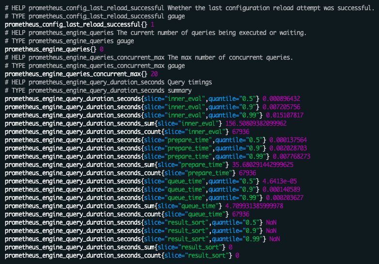

# promcolor

Colorize piped Prometheus metrics in the terminal.  
Browser extension: [prometheus-formatter](https://github.com/fhemberger/prometheus-formatter)



## Installation

Download the latest [release](https://github.com/fhemberger/promcolor/releases). Or if you have Go installed:

```sh
go get github.com/fhemberger/promcolor
```

## Usage

```sh
curl http://127.0.0.1:9100/metrics | promcolor
```


## License

[MIT](LICENSE)
